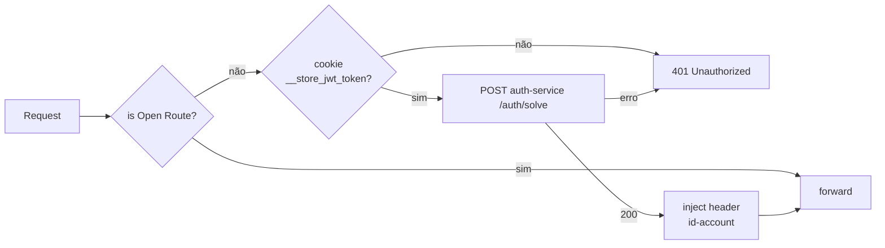

# Rotas e segurança

## Mapa de rotas

| Predicate | Destino interno |
|---|---|
| `/accounts/**` | `http://account:8080` |
| `/auth/**` | `http://auth:8080` |
| `/products/**` | `http://product:8080` |
| `/orders/**` | `http://order:8080` |
| `/exchanges/**` | `http://exchange:8000` |
| `/insper/**` | `http://www.insper.edu.br` |

## Filtro de autorização (`AuthorizationFilter`)



## Rotas abertas

```java
List.of(
    "/auth/login",
    "/auth/register",
    "/auth/health-check",
    "/accounts/health-check"
);
```

Health-check do próprio gateway (`/health-check`) também passa.

## CORS

Configurado em `application.yaml` via `globalcors`:

```yaml
spring:
  cloud:
    gateway:
      server:
        webflux:
          globalcors:
            corsConfigurations:
              '[/**]':
                allowedOrigins: ${CORS_ALLOWED_ORIGINS:*}
                allowedHeaders: "*"
                allowedMethods: "*"
                allowedCredentials: ${CORS_ALLOWED_CREDENTIALS:true}
```

## Ingress (produção EKS)

`k8s/ingress.yaml` declara `ingressClassName: nginx` e roteia `/(.*)`
para `gateway:8080`. nginx-ingress controller é instalado via Helm
(`infra/eks/nginx-ingress-values.yaml`) e provisiona um Network Load
Balancer da AWS automaticamente.

## HPA (demo)

`k8s/hpa.yaml`:

```yaml
minReplicas: 1
maxReplicas: 5
metrics:
  - resource: cpu
    target: 50%
```

Disparado pelo k6 stress (`scripts/k6/gateway-stress.js`) — escala
1 → 5 réplicas em ~1min.
